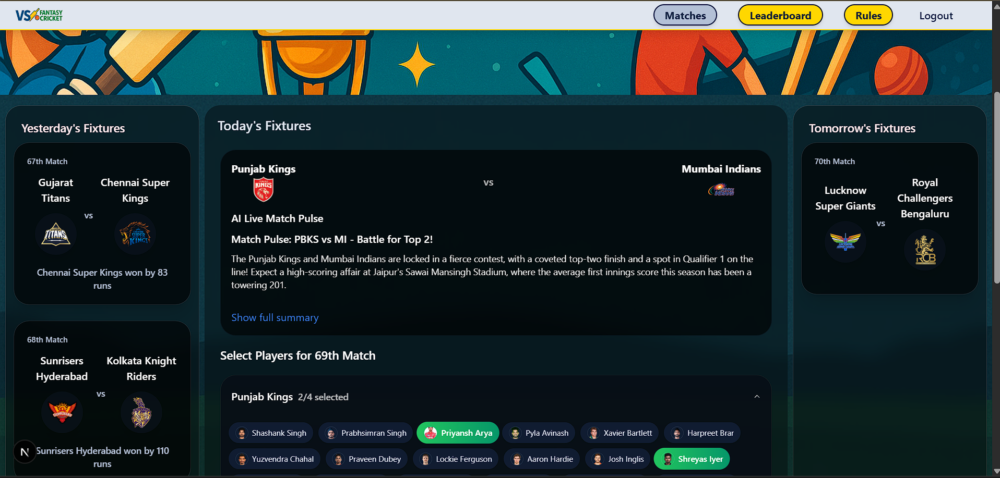
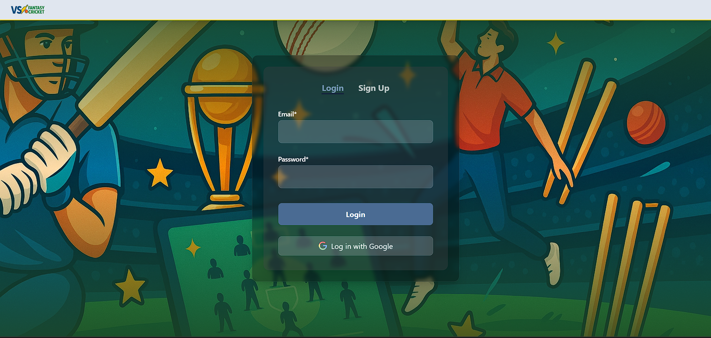
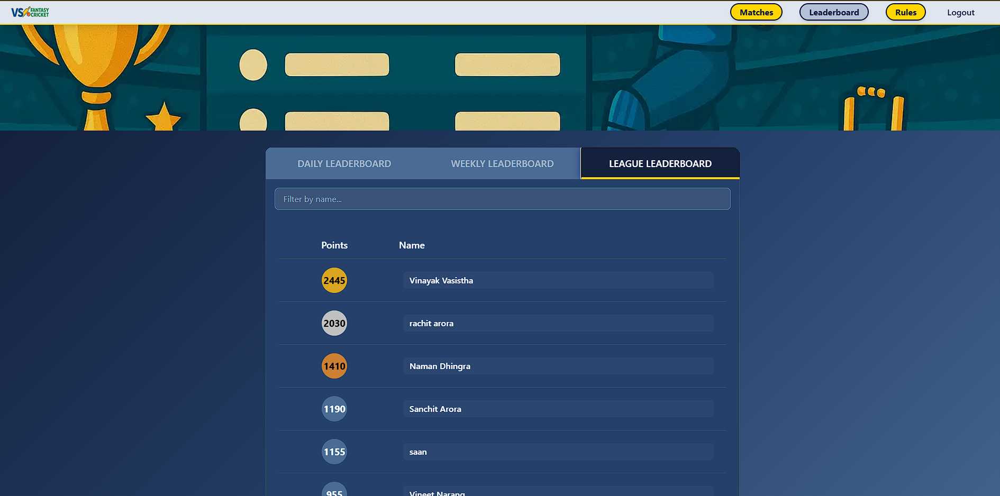
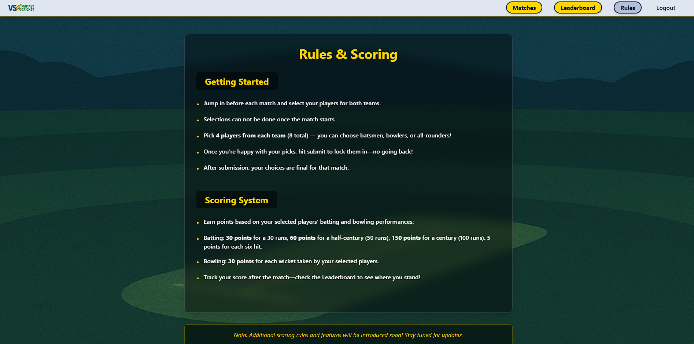
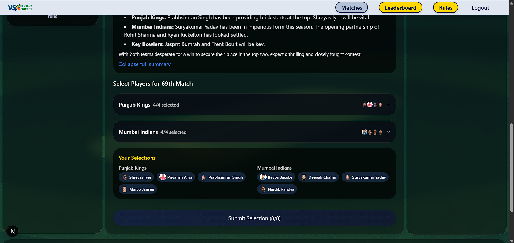
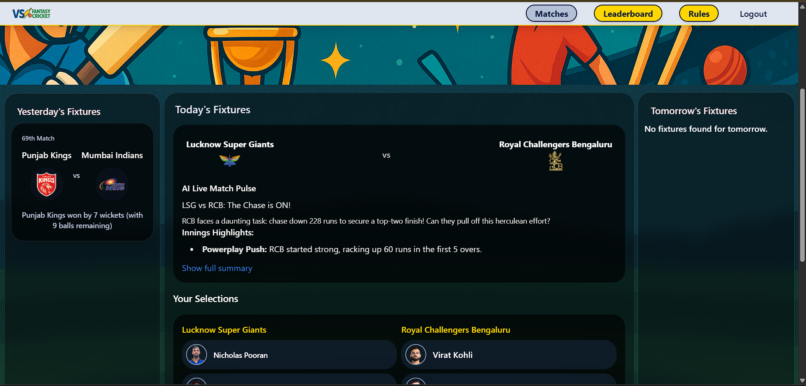
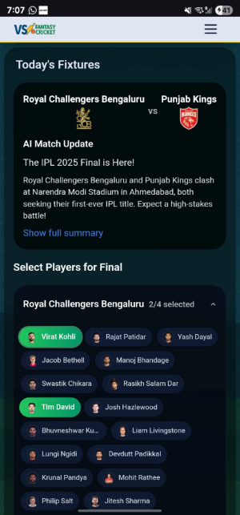
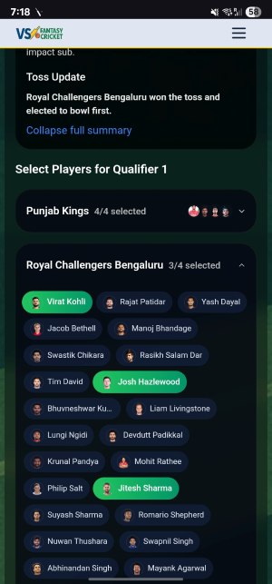
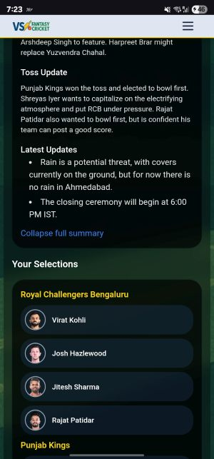

# Fantasy Cricket App

This project is a Fantasy Cricket web app built with Next.js, Tailwind CSS, and Supabase. It features OAuth and email-password based authentication, match view and player selection, and weekly and league leaderboards. Currently only supports Indian Premier League (IPL), but can be extended to other leagues by adding the required API endpoints.



## Technologies Used

- **Next.js** (React framework for SSR and SSG)
- **Tailwind CSS** (Utility-first CSS framework)
- **Supabase** (Backend-as-a-Service: authentication, database)
- **AOS** (Animate On Scroll library for UI animations)

## Getting Started

### Prerequisites
- Node.js (v16 or later recommended)
- npm or yarn
- Supabase account
- Sportmonks API key

### Installation & Local Setup

1. **Clone the repository:**
   ```bash
   git clone <repo-url>
   cd fantasy-cricket
   ```
2. **Install dependencies:**
   ```bash
   npm install
   # or
   yarn install
   ```
3. **Configure environment variables:**
   - Create a `.env.local` file in the root directory.
   - Add the following variables (replace with your actual Supabase project values):
     ```env
     SUPABASE_URL=your-supabase-url
     SUPABASE_SERVICE_ROLE_KEY=your-supabase-service-role-key
     # (Other required variables, e.g. SPORTMONKS_API_TOKEN, etc)
     ```
   - **Important:** The Service Role Key is never exposed to the client/browser. All database connections that require elevated privileges are handled server-side only via Next.js API routes.
   - **User Profile Creation:** User profiles are now automatically created in the `users` table by a Supabase trigger/function when a new user signs up. The `full_name` is passed as part of the sign up metadata (no more `first_name`/`last_name`). Do **not** manually insert into the `users` table after sign up.
   - **User Profile Fetching:** User profile data (such as `full_name`) is fetched directly from Supabase using the client SDK on the frontend. There is no longer any need for a `/api/profile` endpoint for user session/profile logic.
4. **Run the development server:**
   ```bash
   npm run dev
   # or
   yarn dev
   ```
   The app will be available at [http://localhost:3000](http://localhost:3000)

## Project Structure

- **components/**: Contains React components (AuthForm, Matches, Leaderboard, Navbar, etc.)
- **lib/**: Supabase client configuration
- **pages/**: Next.js pages and API routes
- **styles/**: Global CSS (Tailwind CSS) files
- **public/**: Static assets (images, icons, etc.)

## Authentication & Account Management

See [AUTHENTICATION.md](./AUTHENTICATION.md) for details on how sign up, user profile creation, logout, and account deletion are handled, including Supabase triggers and security notes.

## Environment Variables

The app requires the following environment variables in `.env.local`:

```env
NEXT_PUBLIC_SUPABASE_URL=your-supabase-url
NEXT_PUBLIC_SUPABASE_ANON_KEY=your-supabase-anon-key
SUPABASE_URL=your-supabase-url
SUPABASE_SERVICE_ROLE_KEY=your-supabase-service-role-key
SPORTMONKS_API_TOKEN=your-sportmonks-api-token
```

**Security Note:**
- All Supabase database operations are performed server-side using the Service Role Key `SUPABASE_SERVICE_ROLE_KEY`.
- The Service Role Key must never be exposed to the client/browser. Do not use it in any client-side code or in the public environment variables.
- The app architecture enforces this by routing all database operations through Next.js API endpoints.
- The app uses Supabase for authentication and user session management.
- The Supabase anon key is used to fetch the user profile from the database and manage the user session `NEXT_PUBLIC_SUPABASE_ANON_KEY`. - Enable RLS policy for database tables to prevent unauthorized access.
You can find these values in your [Supabase project settings](https://app.supabase.com/).

## Usage

- **Authentication:** Users can sign up and log in using OTP-based authentication (email/password) or Google OAuth.
- **Matches:** View upcoming and past matches, select players, and manage your fantasy team.
- **Dynamic AI Match Summary:** Get AI-generated insights that adapt to the match status:
    - **Fixture Preview (Upcoming):** Provides a pre-match analysis, including probable XI, pitch report, players to watch, and key match-ups. The heading will be "AI Fixture Preview".
    - **Live Match Pulse (Live):** During live matches, offers real-time updates on key events, momentum shifts, and standout performances (refreshes frequently). The heading changes to "AI Live Match Pulse".
    - **Match Update (Starting Soon/Delayed):** For matches about to start or delayed, gives a quick update. Heading: "AI Match Update".
    - **Match Report (Finished):** After completion, delivers a post-match analysis, highlighting key performances and the result. Heading: "AI Match Report".
- **Leaderboard:** Track your score and see how you rank against other users. Leaderboards now use an optimized logic for scoring and debug output.
- **Rules & Scoring:**
  - Batting: 30 points for 30 runs, 60 points for 50 runs, 150 points for 100 runs (only highest milestone per player is awarded)
  - Bowling: 30 points per wicket
  - Sixes: 5 points per six hit
  See [Selections & Scoring](./docs/selections-scoring.mdx) for details.
- **UI Enhancements:** The "AI Fixture Summary" heading uses the AuroraText effect for a modern look. Summaries are expandable/collapsible for better user experience.

## Customization

- **Styling:** The app uses a custom navy color palette defined in `tailwind.config.js`.
- **Backend:** All authentication and data storage is handled via Supabase.

## Screenshots

### Login Page


### Fixtures Page


### Leaderboard Page


### Rules Page


### More screenshots

#### Big screen device




#### Small screen device






## License

GNU v3 for source code. See [LICENSE](./LICENSE) for details.